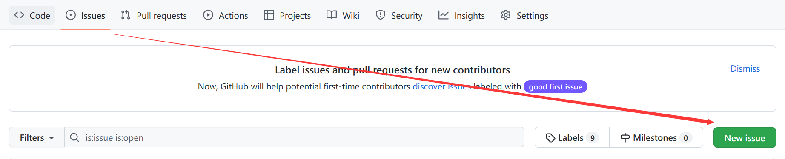

# 这顿吃什么

根据皮蛋食堂量身定做，欢迎各位提交pr增加新菜，正好学习如何使用git

## 如何完善菜品种类

如果你熟悉js，会提交PR(pull request)，那么你可以在这里提交你的菜品种类，我会在这里添加到菜单中

如果你不会提交PR，请点击issues按钮，开启一个新的issue，把你的菜品种类提交过来

如果以上两种你都不会，可以微信搜索关注 [山警网络空间安全实验室](https://mp.weixin.qq.com/s/HFOvgaMjGUY6Ouu-GUgp_A)，将你想要添加的菜品发送到公众号后台

也欢迎各位提出更多的新点子，为信息化校园生活助力！

## 协议

基于 [WTFPL](https://en.wikipedia.org/wiki/WTFPL) 协议开源。
